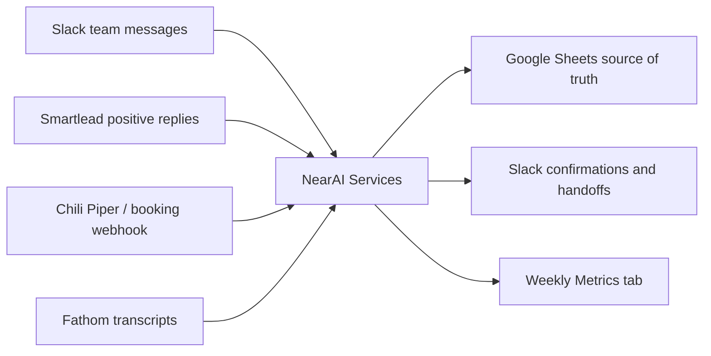

# Architecture

## Decision

Use a small cloud-hosted Node service as the automation layer.

Google Sheets remains the database. Slack remains the UI. External systems call webhook endpoints or scheduled sync jobs. The backend owns idempotency, event logging, AI extraction, and cross-tab synchronization.

## Why

NearAI Services needs to accept Slack events, Smartlead events, booking events, Fathom transcript events, and scheduled metrics. A service is more reliable than spreadsheet scripts for:

- Slack request signing and event retries.
- Webhook authentication.
- Idempotency across external systems.
- Error handling and replay from the `Events` tab.
- LLM-based extraction with a stable schema.
- Cloud deployment independent of Franco's laptop.

## Tradeoffs

The service requires deployment and secrets. That is the main cost.

The alternative, Apps Script, is faster to paste into the spreadsheet but weaker for secure Slack events, webhook verification, logs, retries, and multi-system integrations. For a business workflow that will become operational muscle, the deployed service is the better long-term choice.

## Data Model

The sheet remains human-readable, but automation needs a few reliability fields:

- Stable IDs (`Lead ID`, `Deal ID`, `Handoff ID`)
- `Entity Key` derived from company domain plus contact email
- Source event IDs to prevent duplicates
- Created and updated timestamps
- Slack thread links for auditability
- Handoff status so the same deal is not posted twice
- `Events` tab for every webhook or scheduled sync

This avoids silent duplicate rows and lets the team keep editing the spreadsheet manually.

## Integration Flow

## Critical Risks

- Smartlead and Chili Piper payload shapes vary by setup. The adapters are tolerant, but production verification needs real payload samples.
- Public Fathom share links are parsed directly for call metadata and transcript-copy output. Private or locked-down links may still require `FATHOM_API_KEY` or pasted transcript text.
- Owner ambiguity exists between Kevin and Kelvin. The `Config` tab maps aliases to canonical owners and Slack IDs.
- Google Sheets is not a transactional database. The service minimizes risk with idempotent event IDs, row-level upserts, and one writer process. If usage grows materially, the next step is a small queue, not a CRM.
